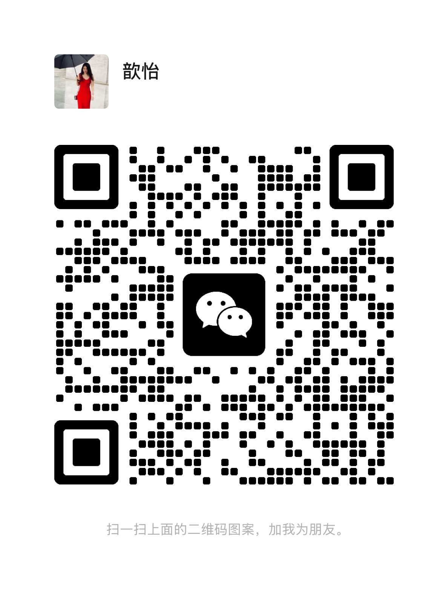

# done-summary-skill

**English** | [中文](#中文) | [العربية](#arabic) | [한국어](#korean) | [日本語](#japanese)

A lightweight Codex skill for turning completed AI work into reusable project memory.

It helps an AI agent produce a structured “Done Summary” after implementation, debugging, deployment, research, or multi-step work.

### About The Creator

Created by **Xinyi Chen (陈歆怡)**, a Zhejiang native based in Shanghai. She is the founder and CEO of **HEDGE Global / 海聚海外**, working across premium international education, global expansion, and technology investment. She used to love spontaneous travel; now she is a vibe coding enthusiast.

If you also enjoy vibe coding and want to exchange ideas, you can connect on WeChat: `chenxinyi_g`.

<p>
  
</p>

## Language Templates

| Language | Template |
|---|---|
| English | [`done-summary.en.md`](done-summary-skill/assets/templates/done-summary.en.md) |
| 中文 | [`done-summary.zh.md`](done-summary-skill/assets/templates/done-summary.zh.md) |
| العربية / Saudi readers | [`done-summary.ar-sa.md`](done-summary-skill/assets/templates/done-summary.ar-sa.md) |
| 한국어 | [`done-summary.ko.md`](done-summary-skill/assets/templates/done-summary.ko.md) |
| 日本語 | [`done-summary.ja.md`](done-summary-skill/assets/templates/done-summary.ja.md) |

## Why

AI work often disappears into chat history. This skill forces useful closure:

- what changed
- why it changed
- what was verified
- what failed or nearly failed
- what should be remembered next time

The goal is simple: do not let Project B repeat Project A's mistakes.

## What It Produces

A Done Summary normally includes:

1. Goal
2. Who did what
3. Why this approach
4. Final result
5. Verification
6. Pitfalls
7. Risks and open items
8. Next step
9. Reusable knowledge

## Install

Copy the skill folder into your Codex skills directory:

```bash
cp -R done-summary-skill ~/.codex/skills/
```

Then invoke it explicitly:

```text
Use $done-summary-skill to write a completion summary after this task.
```

Or ask naturally:

```text
Write a done summary for this task.
```

## Repository Structure

```text
done-summary-skill-release/
  README.md
  LICENSE
  assets/
    wechat-xinyi-chen.jpg
  done-summary-skill/
    SKILL.md
    agents/openai.yaml
    checklists/
      done-summary-checklist.md
      privacy-redaction-checklist.md
    examples/
      code-fix.md
      data-analysis.md
      deployment-release.md
      research-report.md
    scripts/
      new_summary.py
    assets/templates/done-summary.ar-sa.md
    assets/templates/done-summary.en.md
    assets/templates/done-summary.ja.md
    assets/templates/done-summary.ko.md
    assets/templates/done-summary.zh.md
  examples/
    sanitized-example.md
```

## Multilingual Strategy

This repository keeps the README and templates multilingual:

- `SKILL.md` includes both English and Chinese trigger terms.
- `README.md` includes English, Chinese, Arabic, Korean, and Japanese sections for GitHub readers.
- Templates are split by language to avoid awkward mixed-language summaries.
- In addition to English and Chinese, the skill includes Arabic for Saudi readers (`ar-SA`), Korean (`ko`), and Japanese (`ja`) templates.

For most teams, this is better than maintaining multiple separate repositories.

## Additional Language Materials

The templates folder includes:

- `done-summary.ar-sa.md`: Arabic template written in clear formal Arabic for Saudi readers.
- `done-summary.ko.md`: Korean template.
- `done-summary.ja.md`: Japanese template.

Use these when the user requests a Done Summary in Arabic, Korean, or Japanese.

## Examples And Checklists

The skill includes sanitized examples for common work types:

- Code fix
- Deployment release
- Research report
- Data analysis

It also includes two practical checklists:

- Done Summary quality checklist
- Privacy redaction checklist

These are bundled inside `done-summary-skill/`, so they are available after installation.

## Generate A Blank Summary

Use the bundled script to create a blank summary from any language template:

```bash
python done-summary-skill/scripts/new_summary.py --lang zh --output 完工总结.md
python done-summary-skill/scripts/new_summary.py --lang en --output done-summary.md
python done-summary-skill/scripts/new_summary.py --lang ar-sa --output done-summary-ar.md
python done-summary-skill/scripts/new_summary.py --lang ko --output done-summary-ko.md
python done-summary-skill/scripts/new_summary.py --lang ja --output done-summary-ja.md
```

Print supported languages:

```bash
python done-summary-skill/scripts/new_summary.py --list
```

## Safety

Do not publish real production summaries without redaction. Remove:

- secrets and tokens
- private account details
- private phone numbers or emails
- customer data
- internal deployment IDs if sensitive
- non-public commercial strategy

Use `examples/sanitized-example.md` as the style reference for public examples.

---

## 中文

`done-summary-skill` 是一个轻量 Codex Skill，用来把 AI 完成任务后的结果、判断、验证、踩坑和可复用经验整理成「完工总结」。

### 关于我

由 **陈歆怡（Xinyi Chen）** 创建。陈歆怡是在上海的浙江人，海聚海外（HEDGE Global）创始人兼 CEO，长期深耕高端国际教育、企业出海和科技投资。以前喜欢随心旅行，现在是 Vibe coding 爱好者。

想要交流 vibe coding 的朋友，欢迎加微信：`chenxinyi_g`，也可以扫描下方二维码添加。

<p>
  
</p>

它适合用于：

- 功能实现后
- Bug 修复后
- 部署发布后
- 调研分析后
- 配置排查后
- 多步骤任务结束后

## 为什么需要它

很多 AI 工作会消失在聊天记录里。这个 Skill 的目标是让任务结束时自动沉淀：

- 做了什么
- 为什么这么做
- 验证了什么
- 中间踩了什么坑
- 下次遇到类似任务该复用什么经验

一句话：不要让 B 项目继续踩 A 项目踩过的坑。

## 输出结构

「完工总结」通常包括：

1. 本次目标
2. 谁做了什么
3. 为什么这么做
4. 最终结果
5. 验证情况
6. 中间踩坑
7. 风险与未完成事项
8. 下一步
9. 值得沉淀

## 安装

把 `done-summary-skill` 文件夹复制到 Codex skills 目录：

```bash
cp -R done-summary-skill ~/.codex/skills/
```

使用时可以说：

```text
Use $done-summary-skill to write a completion summary after this task.
```

或者中文：

```text
请用 done-summary-skill 给这个任务写一份完工总结。
```

## 是否需要多语言版本

建议需要，但不用做得很重。

推荐方案是：

- GitHub `README.md` 多语言展示；
- `SKILL.md` 保持简洁，包含中英触发词；
- 模板按语言拆分，当前包含中文、英文、面向沙特读者的阿拉伯语、韩语、日语；
- 示例使用去敏版本。

这样既方便国际化传播，也保留「完工总结」这个中文概念的辨识度。

## 新增语言材料

模板目录已经包含：

- `done-summary.ar-sa.md`：面向沙特读者的正式阿拉伯语模板。
- `done-summary.ko.md`：韩语模板。
- `done-summary.ja.md`：日语模板。

当用户需要阿拉伯语、韩语或日语版本的完工总结时，可以直接使用对应模板。

## 案例、检查清单和脚本

这个 Skill 现在内置了更多去敏案例：

- 代码修复
- 部署发布
- 调研报告
- 数据分析

也内置了两个检查清单：

- 完工总结质量检查清单
- 隐私去敏检查清单

还提供一个小脚本，可以根据语言模板生成空白总结文件：

```bash
python done-summary-skill/scripts/new_summary.py --lang zh --output 完工总结.md
python done-summary-skill/scripts/new_summary.py --lang ja --output done-summary-ja.md
```

<a id="arabic"></a>

## العربية

يتضمن هذا المستودع قالبًا عربيًا واضحًا ومناسبًا للقراء في السعودية:

[`done-summary.ar-sa.md`](done-summary-skill/assets/templates/done-summary.ar-sa.md)

استخدم هذا القالب عندما تحتاج إلى كتابة "ملخص الإنجاز" باللغة العربية بعد إكمال مهمة، أو إصلاح مشكلة، أو تنفيذ نشر، أو إنهاء عمل متعدد الخطوات.

### نبذة عن المنشئة

أنشأت هذا المشروع **شين يي تشن (Xinyi Chen / 陈歆怡)**، وهي من مقاطعة تشجيانغ وتقيم في شنغهاي. هي مؤسسة والرئيسة التنفيذية لـ **HEDGE Global / 海聚海外**، وتعمل عبر التعليم الدولي عالي المستوى، وتوسّع الشركات عالميًا، والاستثمار التقني. كانت تحب السفر العفوي، وهي الآن من محبي vibe coding.

إذا كنت مهتمًا بتبادل الأفكار حول vibe coding، يمكنك إضافتها على WeChat: `chenxinyi_g`.

<p>
  
</p>

<a id="korean"></a>

## 한국어

이 저장소에는 한국어 완료 요약 템플릿이 포함되어 있습니다:

[`done-summary.ko.md`](done-summary-skill/assets/templates/done-summary.ko.md)

구현, 디버깅, 배포, 리서치, 설정 작업 또는 여러 단계의 작업이 끝난 뒤 결과와 검증, 문제, 다음 단계를 정리할 때 사용할 수 있습니다.

### 만든 사람

이 프로젝트는 **Xinyi Chen (陈歆怡)** 이 만들었습니다. Xinyi Chen은 상하이에 거주하는 저장성 출신으로, **HEDGE Global / 海聚海外**의 창업자이자 CEO입니다. 프리미엄 국제 교육, 기업의 글로벌 진출, 기술 투자 분야에서 일해 왔습니다. 예전에는 즉흥 여행을 좋아했고, 지금은 vibe coding을 즐기는 사람입니다.

vibe coding에 대해 함께 이야기하고 싶은 분은 WeChat에서 `chenxinyi_g`로 연락할 수 있습니다.

<p>
  
</p>

<a id="japanese"></a>

## 日本語

このリポジトリには日本語の完了サマリーテンプレートが含まれています:

[`done-summary.ja.md`](done-summary-skill/assets/templates/done-summary.ja.md)

実装、デバッグ、デプロイ、調査、設定作業、または複数ステップの作業が完了したあとに、結果、検証内容、つまずいた点、次のステップを整理するために使えます。

### 作者について

このプロジェクトは **Xinyi Chen（陈歆怡）** が作成しました。Xinyi Chenは上海を拠点にする浙江省出身で、**HEDGE Global / 海聚海外** の創業者兼CEOです。ハイエンド国際教育、企業の海外展開、テクノロジー投資に長く取り組んでいます。以前は気の向くままの旅が好きで、今はvibe codingを楽しんでいます。

vibe codingについて交流したい方は、WeChatで `chenxinyi_g` を追加できます。

<p>
  
</p>
